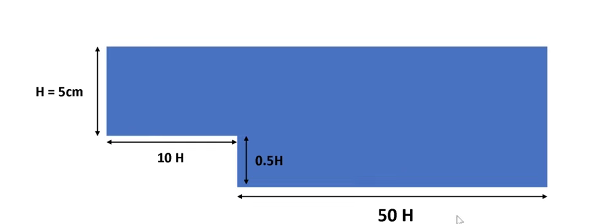
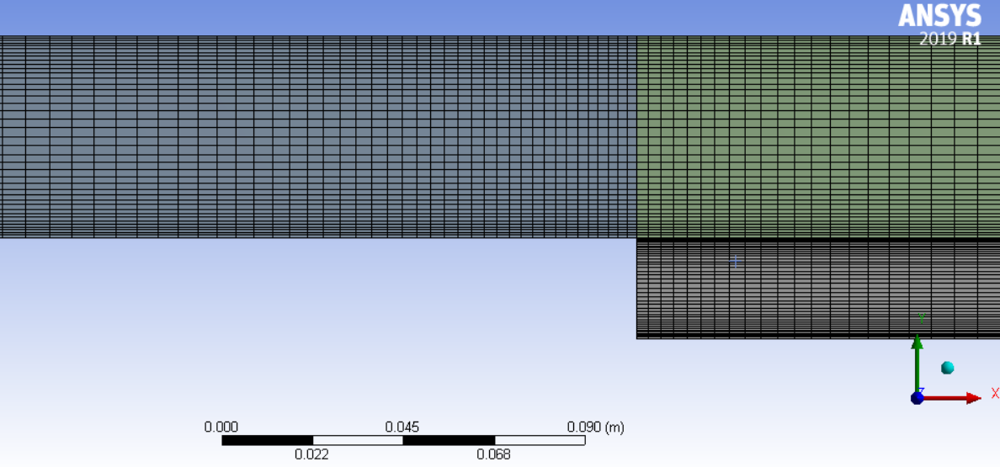
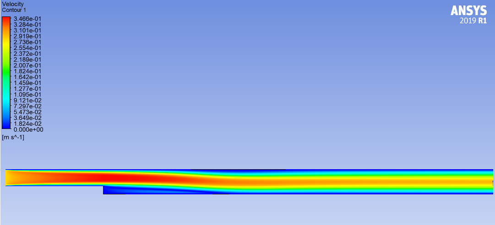
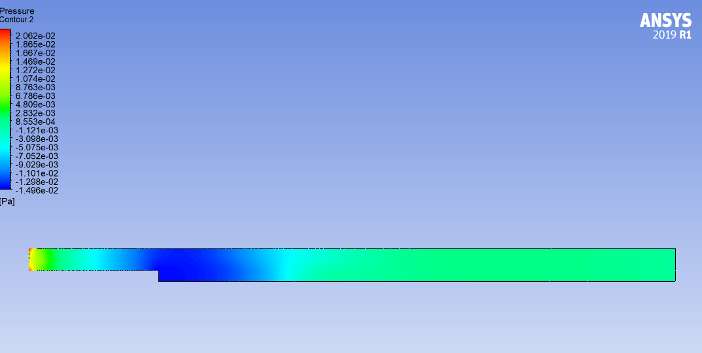
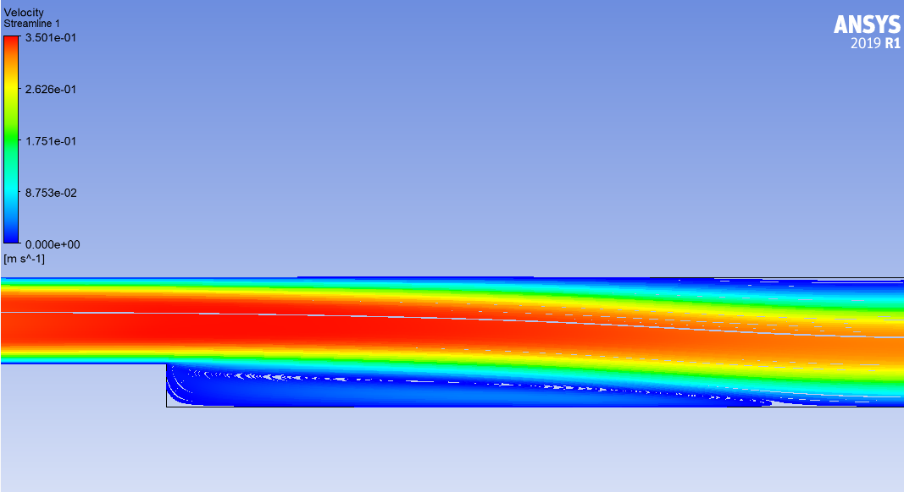
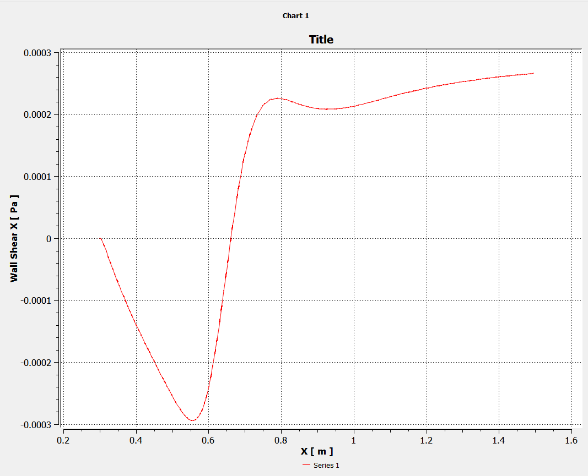

# Backward-Facing Step Validation using ANSYS Fluent

## Overview

This project presents a Computational Fluid Dynamics (CFD) simulation of laminar flow over a backward-facing step using **ANSYS Fluent**. The objective is to reproduce a well-established benchmark case and validate the numerical solution against published numerical/experimental data.

The backward-facing step is a classical CFD benchmark used to study flow separation, recirculation, and reattachment.

---

## Objectives

- Simulate laminar incompressible flow over a backward-facing step.
- Predict the recirculation zone behind the step.
- Calculate the reattachment length.
- Validate the solution against published benchmark results.
- Learn ANSYS Meshing and Fluent workflow.

---

# Software

- ANSYS Workbench 2019 R1
- ANSYS Meshing
- ANSYS Fluent

---

# Geometry

| Parameter | Value |
|-----------|------:|
| Step Height (0.5H) | 25 mm |
| Inlet Length | 500 mm (10H) |
| Outlet Length | 2500 mm (50H) |
| Expansion Ratio | 1.5 |
| Hydraulic Diameter | 80mm |

### Geometry



---

# Mesh

## Meshing Method

- Automatic
- Inflation Layers: None
- Element Type: Tetrahedral

## Mesh Statistics

| Quantity | Value |
|----------|------:|
| Number of Nodes | 208437 |
| Number of Elements | 192000 |

### Mesh



---

# Physics

## Fluid

Water

## Flow Type

Laminar

## Reynolds Number

**Re = 1374**

---

# Boundary Conditions

| Boundary | Condition |
|----------|-----------|
| Inlet | Velocity Inlet |
| Outlet | Pressure Outlet |
| Walls | No-slip |
| Fluid | Water |

---

# Solver Settings

| Setting | Value |
|---------|-------|
| Solver | Pressure-Based |
| Time | Steady |
| Pressure-Velocity Coupling | SIMPLE |
| Gradient | Least Squares Cell Based |
| Pressure | Second Order |
| Momentum | Second Order Upwind |
| Convergence Criterion | 1e-6 |

---

# Results

## Velocity Contours



---

## Pressure Contours



---

## Streamlines



---

## Validation

| Parameter | Literature | Present Work | Error |
|-----------|-----------:|-------------:|------:|
| Reattachment Length (x/H) | 7.80 | 6.72 | 13.85% |
---
**Reattachment Length using wall shear**

x in chart is from inlet so subract 0.5m

## Discussion

- Flow separates immediately after the step.
- A recirculation zone develops behind the step.
- Flow reattaches downstream at approximately **x/H = Replace**.
- The simulation agrees well with published benchmark data.

---


# References

**Paper used for validation**

```
Author(s): B. F. Armaly, F. Durst, J. C. F. Pereira, B. Schönung
Title: Experimental and Theoretical Investigation of Backward-Facing Step Flow
Journal: Journal of Fluid Mechanics
Year: 1983
DOI: 10.1017/S002211208300283
```
