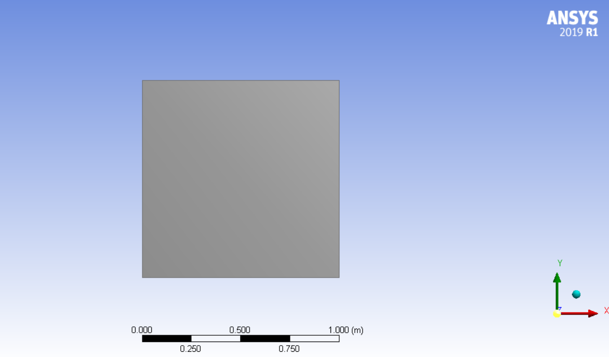
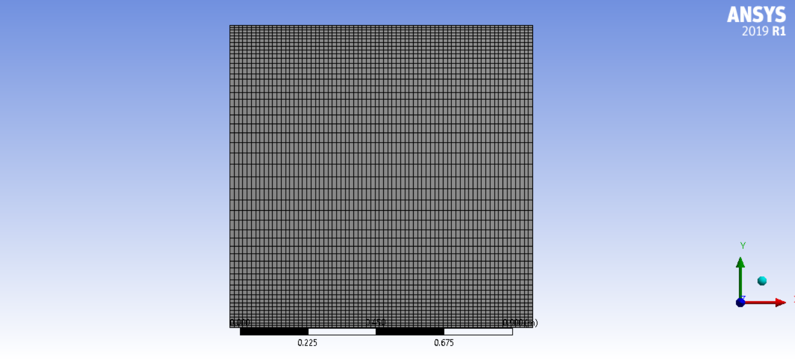
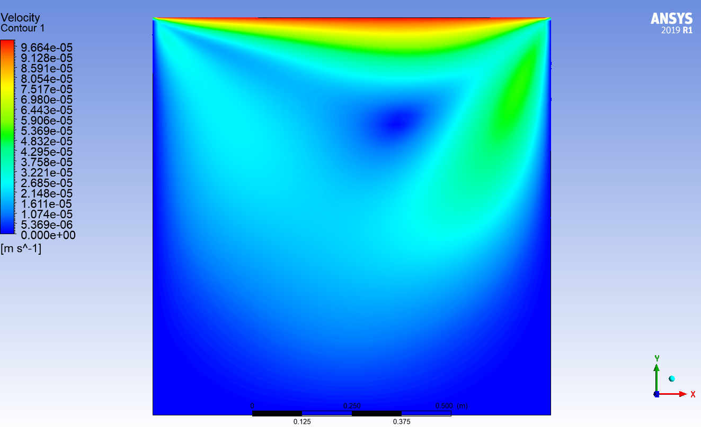
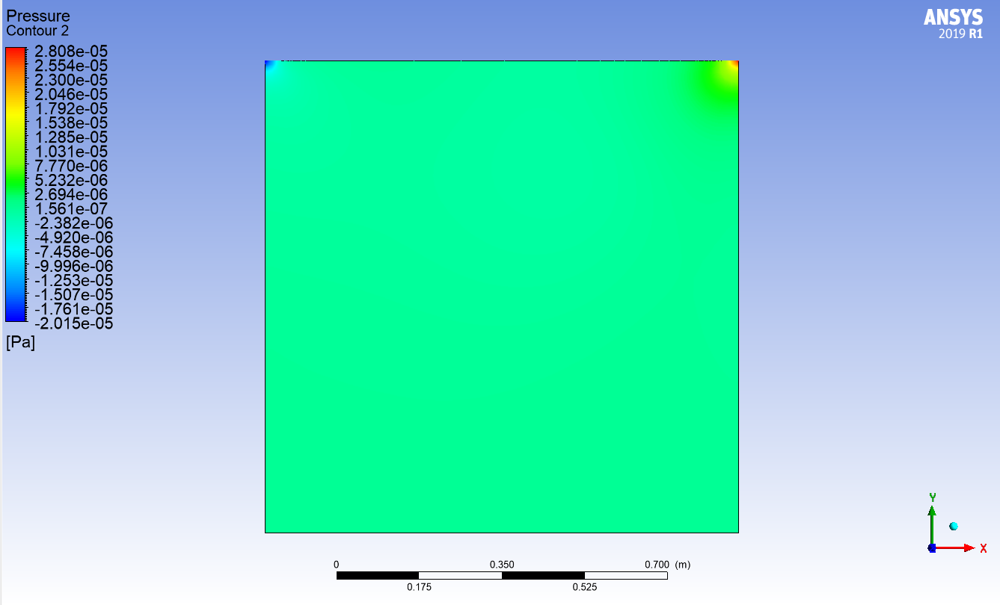
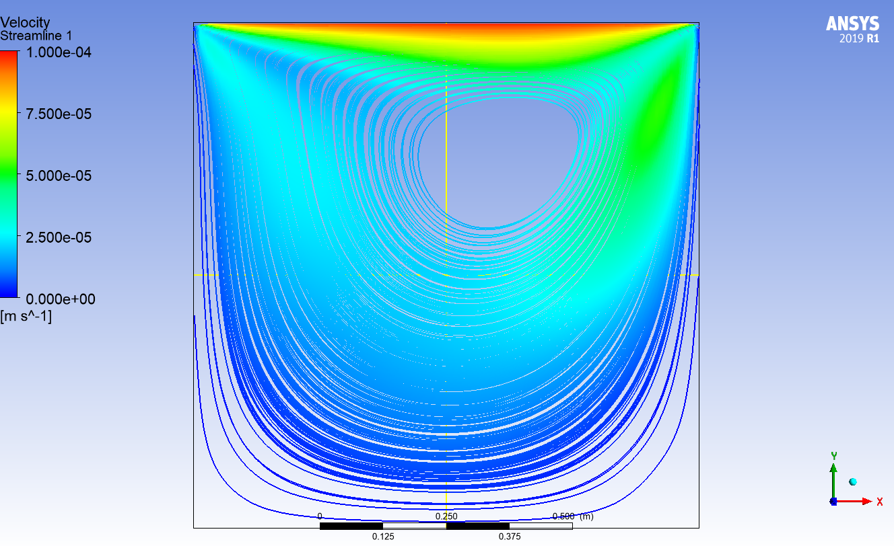
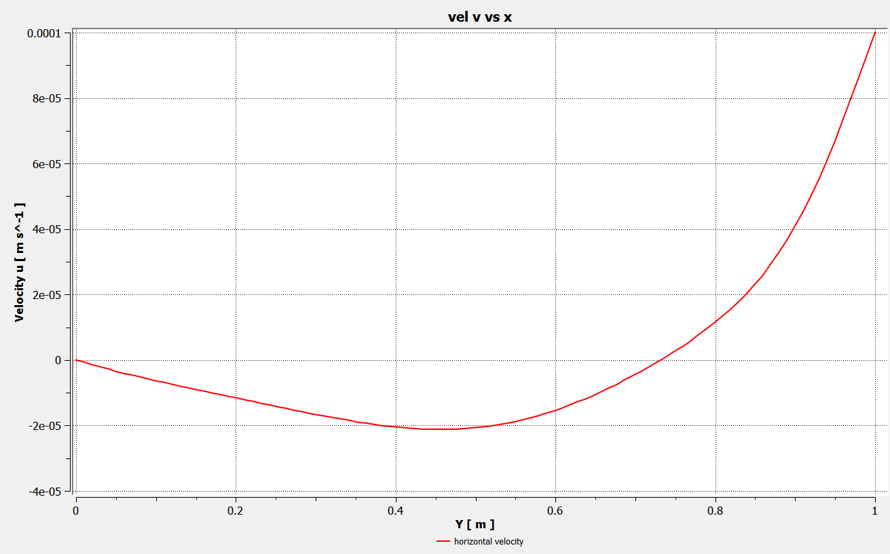
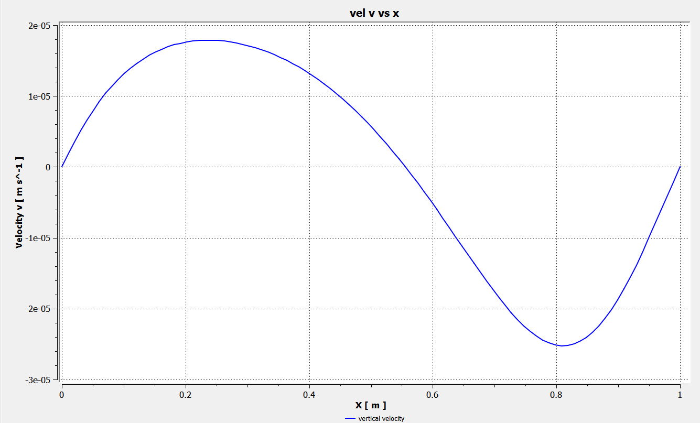
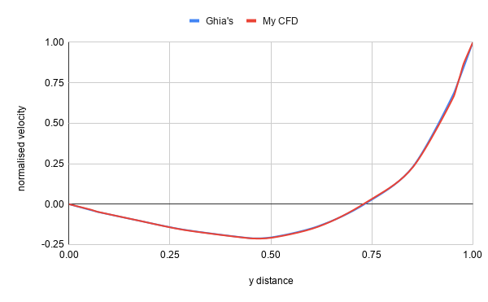

# Lid-Driven Cavity Validation using ANSYS Fluent

## Overview

This project presents a Computational Fluid Dynamics (CFD) simulation of the classical **2D Lid-Driven Cavity** benchmark using **ANSYS Fluent**. The objective is to validate the numerical solution against the benchmark data published by **Ghia et al. (1982)**.

The lid-driven cavity is one of the most widely used validation cases in CFD due to its simple geometry and complex vortex formation, making it ideal for verifying numerical methods and solver accuracy.

---

## Objectives

- Simulate incompressible flow inside a square cavity.
- Analyze vortex formation and velocity distribution.
- Validate velocity profiles against benchmark data.
- Gain experience with structured meshing and solver settings in ANSYS Fluent.

---

# Software

- ANSYS Workbench 2019 R1
- ANSYS Meshing
- ANSYS Fluent

---

# Geometry

| Parameter | Value |
|-----------|------:|
| Cavity Length | 1m |
| Cavity Height | 1m |
| Domain | 1 m × 1 m Square |
| Hydraulic Diameter | 1m |

### Geometry



---

# Mesh

## Meshing Method

- Structured Quadrilateral Mesh
- Inflation Layers: None
- Element Type: Quadrilateral

## Mesh Statistics

| Quantity | Value |
|----------|------:|
| Number of Nodes | 3672 |
| Number of Elements | 3550 |

### Mesh



---

# Physics

## Fluid

Water

## Flow Type

Laminar

## Reynolds Number

**Re = 95**

---

# Boundary Conditions

| Boundary | Condition |
|----------|-----------|
| Top Wall | Moving Wall |
| Top Wall Velocity | 0.0001 m/s |
| Bottom Wall | Stationary No-slip |
| Left Wall | Stationary No-slip |
| Right Wall | Stationary No-slip |

---

# Solver Settings

| Setting | Value |
|---------|-------|
| Solver | Pressure-Based |
| Time | Steady |
| Pressure-Velocity Coupling | SIMPLE |
| Gradient | Least Squares Cell Based |
| Pressure | Second Order |
| Momentum | Second Order Upwind |
| Convergence Criterion | 1e-6 |

---

# Results

## Velocity Magnitude



---

## Pressure Contours



---

## Streamlines



---

## Centerline Velocity Comparison

### Horizontal Velocity (u)



---

### Vertical Velocity (v)



---

# Validation

Comparison with **Ghia et al. (1982)** benchmark solution.

| y | Ghia (Re = 100) | Your CFD | Error (%) |
|---:|----------------:|---------:|----------:|
| 1.0000 | 1.00000 | 1.00000 | 0.00 |
| 0.9766 | 0.84123 | 0.86431 | 2.74 |
| 0.9688 | 0.78871 | 0.79720 | 1.08 |
| 0.9609 | 0.73722 | 0.73166 | 0.75 |
| 0.9531 | 0.68717 | 0.66854 | 2.71 |
| 0.8516 | 0.23151 | 0.22882 | 1.16 |
| 0.7344 | 0.00332 | 0.00837 | 152.24* |
| 0.6172 | -0.13641 | -0.13958 | 2.33 |
| 0.5000 | -0.20581 | -0.20829 | 1.21 |
| 0.4531 | -0.21090 | -0.21213 | 0.58 |
| 0.2813 | -0.15662 | -0.15796 | 0.86 |
| 0.1719 | -0.10150 | -0.10134 | 0.16 |
| 0.1016 | -0.06434 | -0.06387 | 0.73 |
| 0.0703 | -0.04775 | -0.04670 | 2.20 |
| 0.0625 | -0.04192 | -0.04069 | 2.94 |
| 0.0547 | -0.03717 | -0.03451 | 7.16 |
| 0.0000 | 0.00000 | 0.00000 | 0.00 |

**Comparison graph**



---

# Discussion

- A primary vortex forms near the center of the cavity.
- Secondary vortices appear in the cavity corners as Reynolds number increases.
- The velocity profiles closely match the benchmark solution.
- Numerical errors remain within acceptable limits for validation.

---


# References

**Primary Validation Paper**

```
Ghia, U.,
Ghia, K. N.,
Shin, C. T.

High-Re Solutions for Incompressible Flow Using the Navier-Stokes Equations and a Multigrid Method

Journal of Computational Physics

1982

https://doi.org/10.1016/0021-9991(82)90058-4
```
