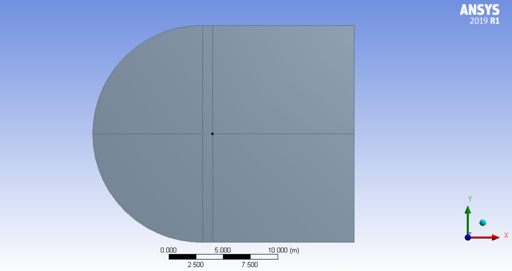
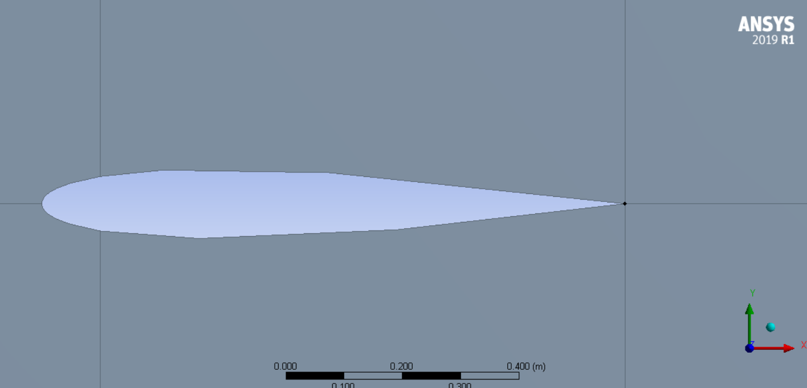
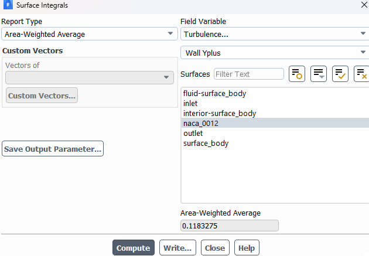
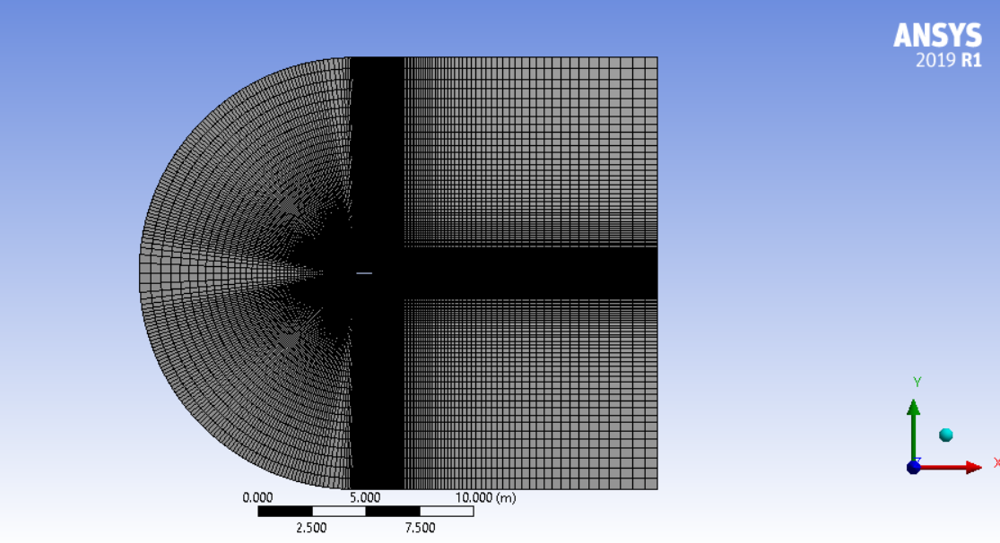
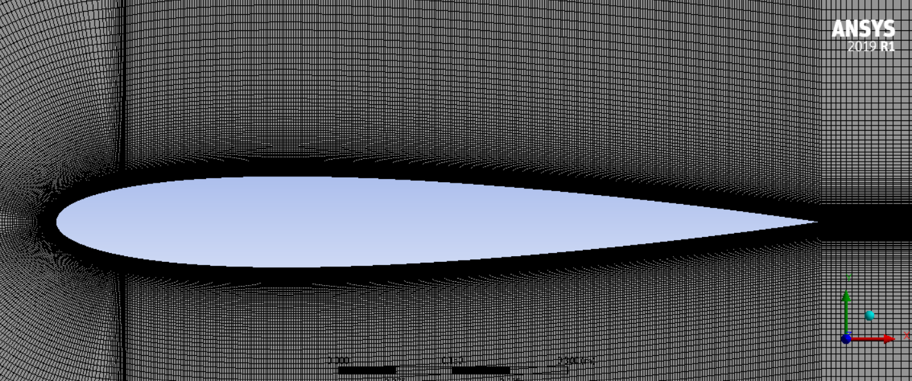
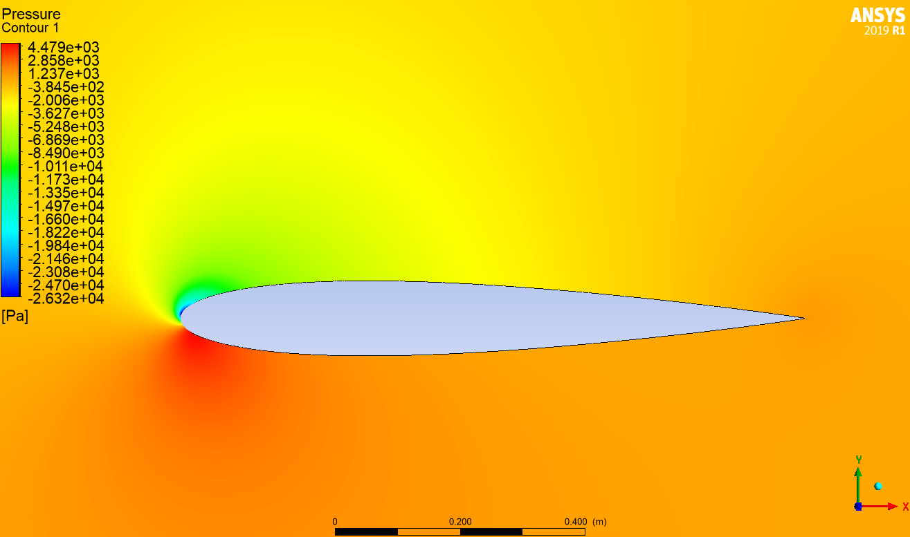
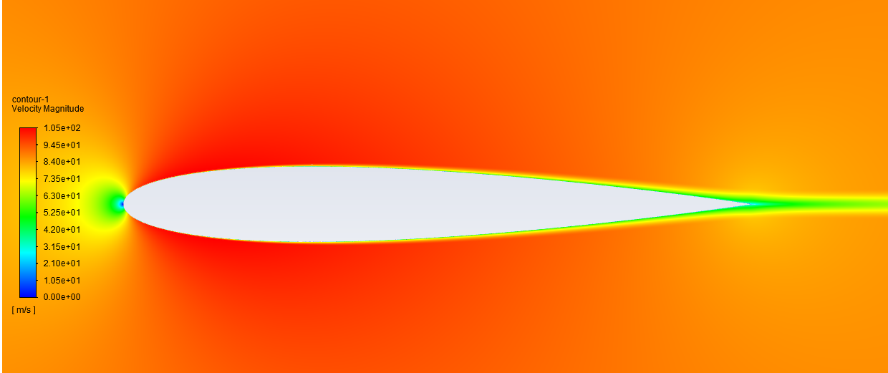
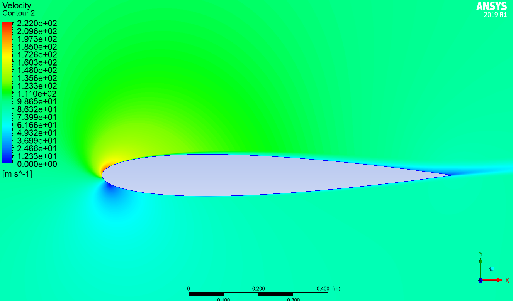
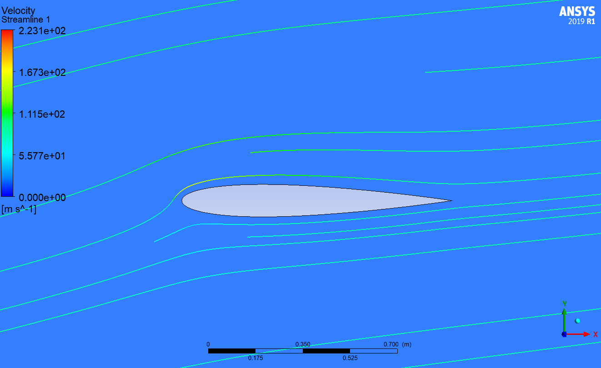

# NACA 0012 Airfoil Validation using ANSYS Fluent

## Overview

This project presents a Computational Fluid Dynamics (CFD) simulation of flow over a **NACA 0012 symmetric airfoil** using **ANSYS Fluent**. The objective is to validate the aerodynamic performance of the numerical model by comparing lift and drag coefficients with published experimental and numerical benchmark data.

The NACA 0012 airfoil is one of the most extensively studied airfoils in aerodynamics and serves as a standard validation case for external flow simulations.

---

# Objectives

- Simulate external flow over a NACA 0012 airfoil.
- Calculate lift and drag coefficients.
- Study pressure distribution around the airfoil.
- Visualize flow separation and wake formation.
- Validate results against published benchmark data.
- Develop proficiency in external aerodynamics simulations using ANSYS Fluent.

---

# Software

- ANSYS Workbench 2019 R1
- ANSYS DesignModeler
- ANSYS Meshing
- ANSYS Fluent

---

# Geometry

| Parameter | Value |
|-----------|------:|
| Airfoil | NACA 0012 |
| Chord Length | 1 m |
| Domain Type | C-Type |
| Upstream Length | 10 m |
| Downstream Length | 14 m |
| Top Boundary | 10 m |
| Bottom Boundary | 10 m |

### Geometry






---

# Mesh

## Meshing Method

- Structured
- Element Type: Quadrilateral
- Inflation Layers: 2
- Growth Rate: 1.2
- Element Order: Linear


## Mesh Statistics

| Quantity | Value |
|----------|------:|
| Number of Nodes | 252154 |
| Number of Elements | 251000 |
| y+ | 0.1183 |



### Mesh





---

# Physics

## Fluid

Air

## Flow Model

Spalart-Allmaras

---

## Operating Conditions

| Parameter | Value |
|-----------|------:|
| Reynolds Number | 6.07 × 10⁶ |
| Mach Number | 0.26 |
| Density | 1.225 kg/m³ |
|Velocity|88.65 m/s|

---

# Boundary Conditions

| Boundary | Condition |
|----------|-----------|
| Inlet | Velocity Inlet |
| Outlet | Pressure Outlet |
| Airfoil | No-slip Wall |
| Top & Bottom | Symmetry |

---

# Solver Settings

| Setting | Value |
|---------|-------|
| Solver | Pressure-Based |
| Time | Steady |
| Pressure-Velocity Coupling | Coupled |
| Gradient | Least Squares Cell-Based |
| Pressure | Second Order |
| Momentum | Second Order Upwind |
| Modified Turbulent Viscosity | Second Order Upwind |
| Turbulence Model | Spalart–Allmaras |
| Pseudo Transient | Enabled |
| Convergence Criterion | Residuals ≤ 1×10⁻⁶ |
---

# Cases Studied

| Angle of Attack (°) | Status |
|--------------------:|-------|
| 0 | ✔ |
| 2 | ✔ |
| 4 | ✔ |
| 6 | ✔ |
| 8 | ✔ |
| 10 | ✔ |
| 12 | ✔ |
| 14 | ✔ |

---

# Results

## Pressure Contours


10deg AOA

---

## Velocity Contours


0deg AOA


10deg AOA

---

## Streamlines


10deg AOA

---

## Lift Coefficient


---

## Drag Coefficient


---

## Lift-to-Drag Ratio


---

# Validation

Comparison with published benchmark data.

```markdown
| AoA (°) | Literature Cl | Present Cl | Cl Error (%) | Literature Cd | Present Cd | Cd Error (%) |
|---------:|--------------:|-----------:|-------------:|--------------:|-----------:|-------------:|
| 0  | -0.0078 (≈0) | -0.00115 | 0.67* | 0.00634 | 0.008313 | 31.1 |
| 2  | 0.2245 | 0.21989 | 2.1 | 0.00672 | 0.008521 | 26.8 |
| 4  | 0.4325 | 0.43890 | 1.5 | 0.00725 | 0.009150 | 26.2 |
| 6  | 0.6557 | 0.65504 | 0.1 | 0.00694 | 0.010223 | 47.3 |
| 8  | 0.8740 | 0.86756 | 0.7 | 0.00803 | 0.011796 | 46.9 |
| 10 | 1.1034 | 1.07242 | 2.8 | 0.01173 | 0.013949 | 18.9 |
| 12 | 1.2960 | 1.24676 | 3.8 | 0.01262 | 0.016856 | 33.6 |
| 14 | 1.4835 | 1.44643 | 2.5 | 0.01784 | 0.020815 | 16.7 |
```

---

# Discussion

- Lift coefficient increases with angle of attack.
- Drag coefficient increases gradually with angle of attack.
- Pressure difference between the upper and lower surfaces generates lift.
- Flow separation becomes more prominent at higher angles of attack.
- Numerical results show good agreement with published validation data.

---

# References

**Primary Validation Paper**

```text
Author(s): Charles L. Ladson

Title: Effects of Independent Variation of Mach and Reynolds Numbers on the Low-Speed Aerodynamic Characteristics of the NACA 0012 Airfoil Section

Journal: NASA Technical Memorandum 4074 (NASA Langley Research Center)

Year: 1988

DOI: N/A (NASA Technical Report)
```

---

# Future Improvements

- Perform mesh independence study.
- Compare different turbulence models.
- Extend the analysis to transient simulations.
- Investigate stall behavior at higher angles of attack.
- Perform Cp validation using experimental data.
