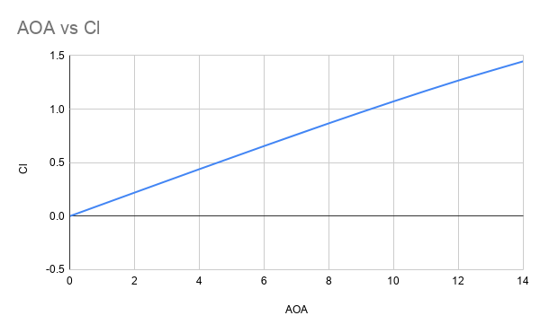
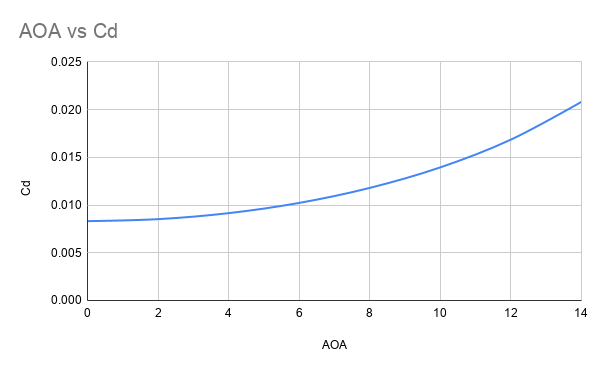

<div align="center">

# 🚀 ANSYS Fluent Benchmark Validation Suite

**A collection of Computational Fluid Dynamics (CFD) benchmark simulations performed using ANSYS Fluent 2019 R1**

Geometry • Meshing • Solver Setup • Validation • Post Processing

<p>


</p>

</div>

---

<p align="center">

</p>

---

# 📖 Overview

This repository contains a collection of benchmark Computational Fluid Dynamics (CFD) simulations performed using **ANSYS Fluent 2019 R1**. The primary objective is to validate numerical solutions against well-established experimental and numerical benchmark data while developing reliable CFD workflows for geometry preparation, meshing, solver configuration, and post-processing.

The repository consists of three classical validation cases commonly used in academia and industry:

- ✈️ **NACA 0012 Airfoil** 
- 🌀 **Lid-Driven Cavity**
- ↩️ **Backward-Facing Step**

Each project includes complete geometry, mesh, solver settings, validation data, and post-processing results.

---
# ✈️ NACA 0012 Airfoil Validation

The **NACA 0012 Airfoil** is the primary focus of this repository and represents the most comprehensive CFD study included here.

The simulation reproduces the aerodynamic characteristics of the widely studied **NACA 0012 symmetric airfoil**, with numerical results validated against NASA experimental data over multiple angles of attack.

### Key Features

- External Aerodynamics
- Reynolds Number: **6.07 × 10⁶**
- Mach Number: **0.26**
- Structured Quadrilateral Mesh
- Average **y⁺ ≈ 0.12**
- Spalart–Allmaras Turbulence Model
- Lift & Drag Validation
- Pressure Distribution
- Wake Visualization
- Streamline Analysis

---

## Pressure Contour

<p align="center">

</p>

---

## Velocity Contours

<p align="center">

</p>

---

## Streamlines

<p align="center">

</p>

---

## Lift Coefficient

<p align="center">

</p>

---

## Drag Coefficient

<p align="center">

</p>

---

# 📂 Repository Overview

| Benchmark | Physics | Validation Reference | Status |
|-----------|----------|----------------------|:------:|
| ✈️ **NACA 0012 Airfoil** | External Aerodynamics | NASA TM 4074 | ✅ |
| 🌀 **Lid-Driven Cavity** | Internal Laminar Flow | Ghia et al. (1982) | ✅ |
| ↩️ **Backward-Facing Step** | Separated Internal Flow | Armaly et al. (1983) | ✅ |

---

# 🖼️ Project Gallery

| NACA 0012 Pressure | NACA Velocity |
|:------------------:|:-------------:|
|  |  |

| Streamlines |
|:-----------:|
|  |

---

## Additional Benchmark Cases

| Lid Driven Cavity | Backward Facing Step |
|:-----------------:|:--------------------:|
|  |  |

---

# ⚙️ CFD Workflow

```text
Geometry
    │
    ▼
Mesh Generation
    │
    ▼
Boundary Conditions
    │
    ▼
Solver Configuration
    │
    ▼
Solution Initialization
    │
    ▼
Residual Convergence
    │
    ▼
Post Processing
    │
    ▼
Validation with Literature
```

---

# 🛠️ Software

| Software | Purpose |
|-----------|---------|
| ANSYS Workbench 2019 R1 | Project Environment |
| DesignModeler | Geometry Creation |
| ANSYS Meshing | Mesh Generation |
| ANSYS Fluent | CFD Solver |
| CFD-Post | Visualization & Analysis |

---

# 🔬 Numerical Methods

| Method | Used |
|---------|:----:|
| Pressure-Based Solver | ✅ |
| Steady State | ✅ |
| SIMPLE Algorithm | ✅ |
| Coupled Solver | ✅ |
| Second Order Upwind | ✅ |
| Least Squares Cell Based Gradient | ✅ |
| Spalart–Allmaras Turbulence Model | ✅ |
| Laminar Flow Model | ✅ |

---

# 📊 Validation Summary

| Benchmark | Reference |
|-----------|-----------|
| NACA 0012 Airfoil | Charles L. Ladson, NASA TM 4074 (1988) |
| Lid-Driven Cavity | Ghia, Ghia & Shin (1982) |
| Backward-Facing Step | Armaly et al. (1983) |

---

# 🎯 Skills Demonstrated

- External Aerodynamics
- Internal Flow Simulation
- Structured Mesh Generation
- Mesh Quality Assessment
- Inflation Layer Design
- Turbulence Modeling
- Laminar Flow Simulation
- Pressure-Based Solvers
- Lift & Drag Extraction
- Pressure Distribution Analysis
- Streamline Visualization
- Velocity Profile Validation
- Reattachment Length Prediction
- CFD Verification & Validation
- Scientific Post-Processing

---

# 📈 Repository Statistics

| Metric | Value |
|---------|------:|
| Benchmark Projects | **3** |
| Validation Papers | **3** |
| Airfoil Cases Simulated | **8** |
| Maximum Mesh Size | **250,000+ Elements** |
| Total Simulated Cells | **450,000+** |
| Validation Status | ✅ Complete |

---

# 🚀 Future Work

- [ ] Mesh Independence Study
- [ ] Grid Convergence Index (GCI)
- [ ] SST k–ω Turbulence Model Comparison
- [ ] Standard k–ε Model Comparison
- [ ] Pressure Coefficient (Cp) Validation
- [ ] Higher Reynolds Number Cases
- [ ] Dynamic Stall Analysis
- [ ] Transient Simulations
- [ ] Compressible Flow Studies

---

# 📚 References

### NACA 0012

**Charles L. Ladson**

*Effects of Independent Variation of Mach and Reynolds Numbers on the Low-Speed Aerodynamic Characteristics of the NACA 0012 Airfoil Section*

NASA Technical Memorandum 4074 (1988)

---

### Lid-Driven Cavity

**Ghia, U., Ghia, K. N., Shin, C. T.**

*High-Re Solutions for Incompressible Flow Using the Navier-Stokes Equations and a Multigrid Method*

Journal of Computational Physics (1982)

---

### Backward-Facing Step

**Armaly, B. F., Durst, F., Pereira, J. C. F., Schönung, B.**

*Experimental and Theoretical Investigation of Backward-Facing Step Flow*

Journal of Fluid Mechanics (1983)

---

<div align="center">

# 👨‍💻 Author

**Piyush**

**B.Tech Mechanical Engineering**  
**Indian Institute of Technology Ropar**


</div>
